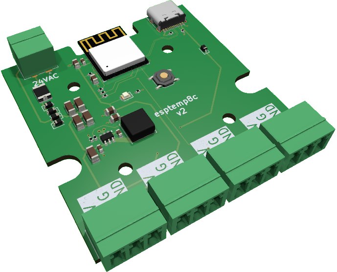

# esptemp8c

Open source, n-channel temperature logger using esphome for Dallas DS18B20 sensors. Powered by an ESP32-C3-MINI, it can be powered by USB-C or by 24VAC.

## Sensors
They can be found at various locations, including [DFRobot](https://www.dfrobot.com/product-689.html), [Adafruit](https://www.adafruit.com/product/381), Digikey or the usual suspects.

You will need to find out your sensor ID's as per the [esphome documentation](https://esphome.io/components/one_wire#one-wire).

### Counterfeit Sensors
If you are using a Dallas DS18B20 sensor, I strongly recommend using Digikey, Mouser or Adafruit to avoid obtaining [counterfeit sensors](https://github.com/cpetrich/counterfeit_DS18B20/tree/master).

## Powering
Only *one* power source should be used.
- USB-C Jack (5V)
- Screw terminal
    - It is designed for 24VAC. 12VAC is probably the minimum required for AC. Do not exceed 24VAC.
    - 9VDC will be the minimum required amount if using DC, and it has been tested up to 24VDC. 

A self-resetting polyfuse is included to protect HVAC equipment if sourcing 24VAC from these units. The polyfuse does NOT apply to power from the USB-C port, as the device supplying power should have overcurrent protection per the USB standard.

## Flashing / Programming
You must hold down the button while plugging in the device the first time to enter programming mode. The device will then show up as a USB device on your computer. You can then use the esphome flasher to flash the device.

Subsequent flashing does not require use of the button - it can be done via USBC or OTA as well.

## Enclosure
Fits in a [Hammond 1593KBK](https://www.hammfg.com/part/1593KBK). Or you can make your own enclosure and 3D-print it (contributions welcome).
