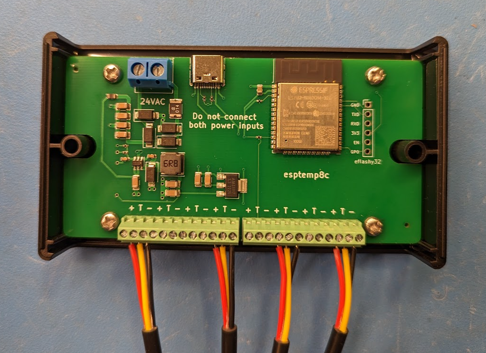

# esptemp8c
8-channel thermocouple logger using esphome for Dallas DS18B20 sensors.

## Sensors
They can be found at various locations, including [DFRobot](https://www.dfrobot.com/product-689.html), [Adafruit](https://www.adafruit.com/product/381), Digikey or the usual suspects.

You will need to find out your sensor ID's as per the [esphome documentation](https://esphome.io/components/sensor/dallas.html).

## Powering
Only *one* power source should be used.
- USB-C Jack (5V)
- Screw terminal
    - It is designed for 24VAC. 12VAC is probably the minimum required for AC, and you might get away with up to 30VAC.
    - 9VDC will be the minimum required amount if using DC, and it has been tested up to 24VDC. 

A self-resetting polyfuse is included to protect HVAC equipment if sourcing 24VAC from these units. The polyfuse does NOT apply to power from the USB-C port, as the device supplying power should have overcurrent protection.
